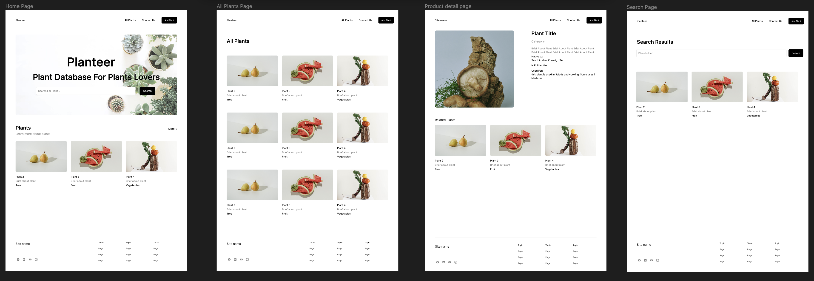
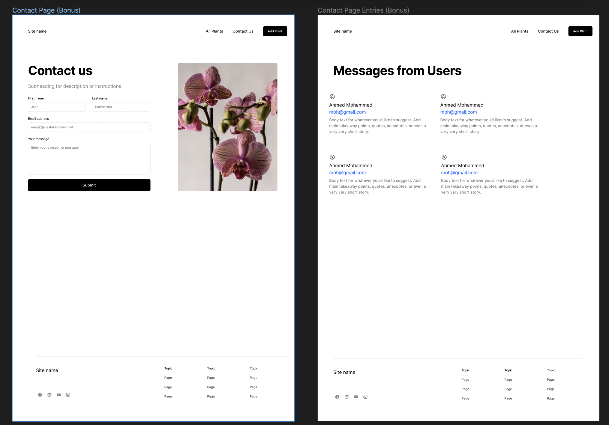
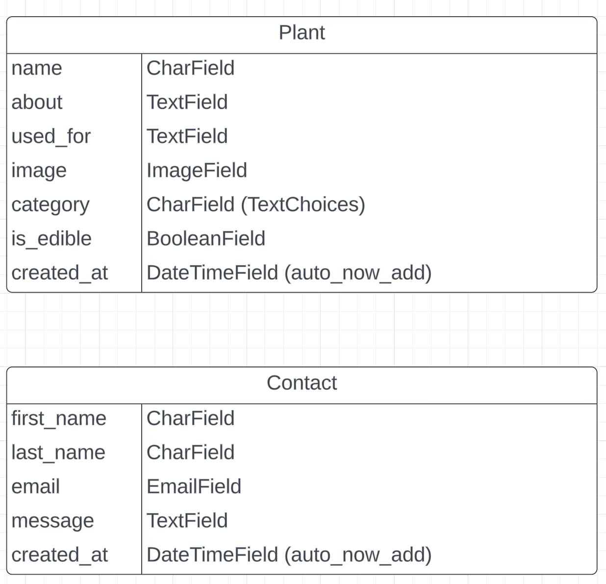

# LAB-ORM-PLANTEER

## Using what you learned, Create a new website called "Planteer" , this website has the following pages/paths:
- Home page `/`
- All Plants page : `plants/all/`
- Plant Detail Page : `plants/<plant_id>/detail/`
- Add new plant page : `plants/new/`
- Update plant page : `plants/<plant_id>/update/`,
- Delete Plant : `plants/<plant_id>/delete/`
- Search Page : `plants/search/`
- Contact Us page : `contact/`
- Contact Us Messages page : `contact/messages/`

### Notes:
- Use templates & template inheritance.
- The website must be responsive (looks good on big and small screens)
- In all plants page, user can filter by `category` and `is_edible`.
- For the images, backgrounds, fonts you can use whatever you like. As for the content like categories,  make sure you add real plants with real plants images.
- Use at least 2 apps, one main and one for the plants.
- Add a related `Comment` model on the plants (fields: plant relation, full_name, content, created_at).  So, visitors can add comments on the plants.
- In Plant detail page , Add related plants (based on the same category, use filter !)
  
## wireframe for the main pages

## Contact pages wireframe:

## UML for the model `Plant` &  `Contact` Model 

